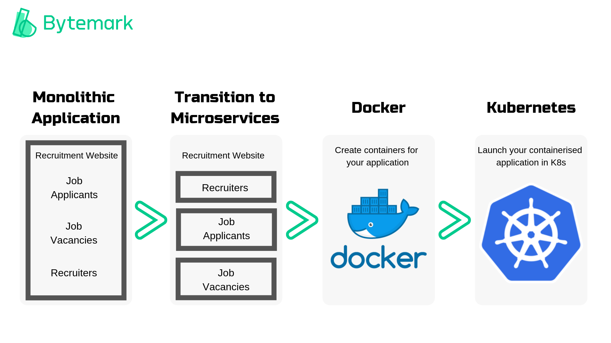

# Docker

## Table Of Contents
- [How To Install Docker](#how-to-install-docker)  
- [Docker Useful Commands](#docker-useful-commands)
- [Pushing A Docker Image To Docker Hub](#pushing-a-docker-image-to-docker-hub)
- [Creating A Docker Image Using Nginx Base Image](#creating-a-docker-image-using-nginx-base-image)

### How To Install Docker
- [Click here](https://docs.docker.com/desktop/windows/install/)
- Download `Docker Desktop For Windows`
- Once this is done make sure Hyper-V is enabled
- Once the docker is downloaded download wsl 2 when prompted
- Finally check in gitbash with `docker version`

### Docker Useful Commands
- `docker images` shows all images
- `docker run` to run an image
- `docker rmi <image name> -f` -f forces it to delete if it is being used
- `alias docker="winpty docker"` allows you to sh into containers easily
- `docker ps` shows running containers
- `docker run -p 2368:2368 ghost` runs ghost image
- `docker rm` remove container
- `docker logs <containerId>` logs for the container
- `docker run --name ghost -d -p 80:2368 ghost` runs ghost image on port 80 with the container name ghost
- `docker run -d -p 4000:4000 docs/docker.github.io` download dockerhub on localhost
- `winpty docker exec -it <name/id> sh` to ssh into a container
- `docker cp <containerId>:/file/path/within/container /host/path/target` Copying a file from container to localhost

### Pushing A Docker Image To Docker Hub
- `docker commit <containername/id> <nameit>`
- `docker tag <containername/id> <username>/<reponame>`
- `docker push <username>/<reponame>`

### Creating A Docker Image Using Nginx Base Image
- Create a `Dockerfile` and add:
```dockerfile
# from which image - image we used as our base image
FROM nginx

# label to communicate with team members
LABEL MAINTAINER=ARMAAN

# copy data from localhost to container
COPY index.html /usr/share/nginx/html/

# expose port 80
EXPOSE 80

# launch/create container
CMD ["nginx", "-g", "daemon off;"]
```
- This uses base nginx image and changes the index file only if you have an index.html in the right location. Once it changes the index file it creates an image

### Creating An App Using Docker-Compose
```
FROM node:latest as APP

WORKDIR /usr/src/app/

COPY app /usr/src/app/

RUN npm install

FROM node:alpine

COPY --from=APP /usr/src/app/ /usr/src/app

WORKDIR /usr/src/app/

EXPOSE 3000

CMD ["node", "app.js"]
```

# Kubernetes

## Tables Of Contents
- [What is K8](#what-is-k8)
- [Benefits Of K8](#benefits-of-k8)
- [Use Cases](#use-cases)
- [How Does It Benefit The Business](#how-does-it-benefit-the-business)
- [K8 Architecture](#k8-architecture)
### What is K8
- To understand the usefulness of Kubernetes we must first understand `immutable infrastructure` and `containers`
  - Immutable Infrastructure is the practice where once servers are deployed they are never modified and instead a new server will be build using a base image
  - Containers is a lightweight and standalone executable that packages all the code and configurations altogether so that it will always run the same no matter which environment it runs in. 
- Kubernetes is a container/microservice platform that orchestrates computing, networking and storage infrastructure workloads. Kubernetes extends how we scale containerzied applications.

### Benefits Of K8
- Horizontal Scaling - Scale your application as needed
- Automated Rollouts & Rollbacks - Rollout changes that monitor the health of your application. If something goes wrong kubernetes will automatically roll back the change
- Service Discovery & Load Balancing - Containers have their own IP which means you can put a number of containers on a single DNS name for load balancing
- Storage Orchestration - Automatically Mounts local, public cloud or a network storage
- Secret & Configuration Management - Create & update secrets and configurations without rebuilding your image
- Self-Healing - The platform heals many problems by restarting failed containers, replacing/rescheduling containers as nodes die, killing containers that dont respond to user-defined health check and also waiting to advertise containers to clients until they're ready 
- Batch Execution - Manage your batch & continuous intergration workloads and replace failed containers
- Automatic Binpacking - Automatically schedules containers based on resource requirements and other constraints

### Use Cases
- Amazon Web Services
- Azure
- Bloomberg
- Google
- Pokemon Go
- The New York Times

### How Does It Benefit The Business
- Highly Portable
- Multi-Cloud Capability
- Highly Flexible 
- Increased Developer Productivity
- Open Source

### K8 Architecture

